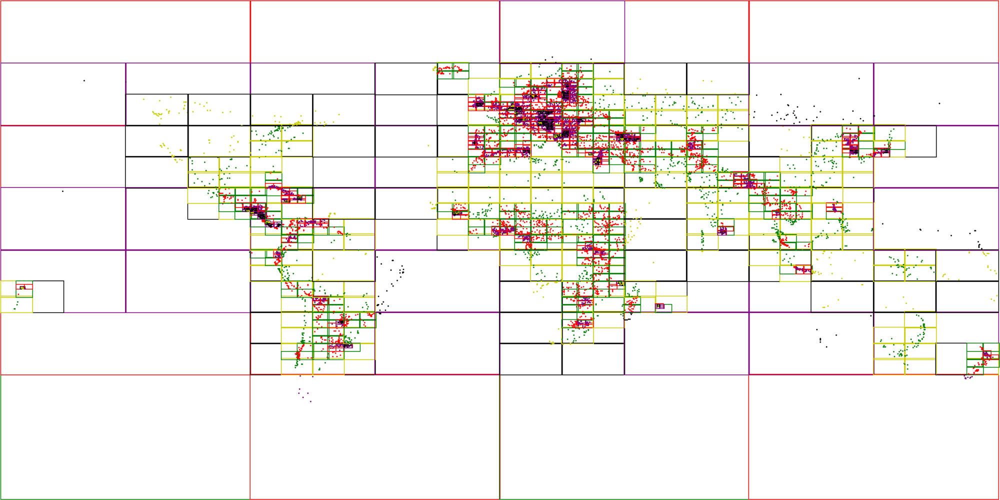

# QTree

[](https://godoc.org/github.com/tidwall/qtree)

This package provides an in-memory quadtree implementation for Go. 



## Usage

### Installing

To start using QTree, install Go and run `go get`:

```sh
$ go get -u github.com/tidwall/qtree
```

### Basic operations

```go
// create a QTree
var tr qtree.QTree

// insert a point
tr.Insert([2]float64{-112.0078, 33.4373}, [2]float64{-112.0078, 33.4373}, "PHX")

// insert a box
tr.Insert([2]float64{10, 10}, [2]float64{20, 20}, "rect")

// search 
tr.Search([2]float64{-112.1, 33.4}, [2]float64{-112.0, 33.5}, 
 	func(min, max [2]float64, value interface{}) bool {
		println(value.(string)) // prints "PHX"
	},
)

// delete 
tr.Delete([2]float64{-112.0078, 33.4373}, [2]float64{-112.0078, 33.4373}, "PHX")
```

## Performance

Pretty, pretty, pretty good.

## License

`qtree` source code is available under the MIT License.
